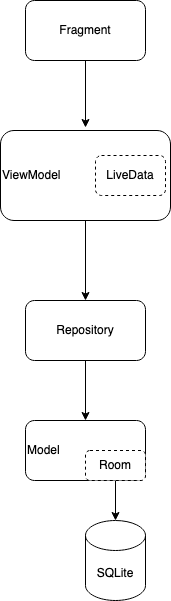

# Architecture
The main philosphy behind the architecture of our app has been to follow the guidelines and best practices as presented by Google themselves. Android has in recent years introduces many new frameworks that try to unite the many ways of doing commons app tasks such as navigation between different parts of the app, persisting data to a database and updating views with the latest data. These parts are now all a part of the Android Architecture Components, also called JetPack. This [document](https://developer.android.com/jetpack/guide) has been used as a startingpoint. 

Perhaps most central to Android app architecture is the design pattern Model-View-ViewModel (MVVM). While we won't describe the details, the overall idea is that the view should subscribe to data which the ViewModel provides. For android apps, this leads to the following overall structure: 

 
## Directory Structure
The directory structure of the project follows a standard android project. In the first directory tree below, the entire set of folder are viewmodel with app as the root. What perhaps is somewhat new compared to many other android project is the file app/src/main/res/navigation.xml which contains the nessecary data to have a navigation graph. This is a part of the Jetpack Compose library and allows us to easier create navigation between the different parts of the app.

The second directory tree focused on the java source code only. Here, each page on the app has a separate folder under changeit/ui and contains both fragment and viewmodel classes.

```bash
.
├── app
│   └── src
│       ├── androidTest
│       │   └── java
│       │       └── com
│       │           └── example
│       │               └── changeit
│       ├── main
│       │   ├── java
│       │   │   └── com
│       │   │       └── example
│       │   │           └── changeit <-- source code
│       │   └── res
│       │       ├── drawable <-- images
│       │       ├── layout <-- xml views
│       │       ├── menu <-- menu definition
│       │       ├── navigation <-- navigation graph
│       │       └── values <-- variois values
│       └── test
│           └── java
│               └── com
│                   └── example
│                       └── changeit <-- unit tests
└── gradle
```


```bash
.
└── changeit
    ├── db
    │   └── dao
    ├── model
    ├── ui
    │   ├── ad
    │   ├── contactinfo
    │   ├── favorites
    │   ├── home
    │   └── profile
    └── util
```

