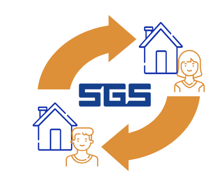
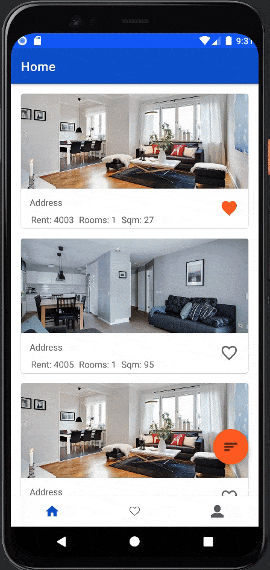
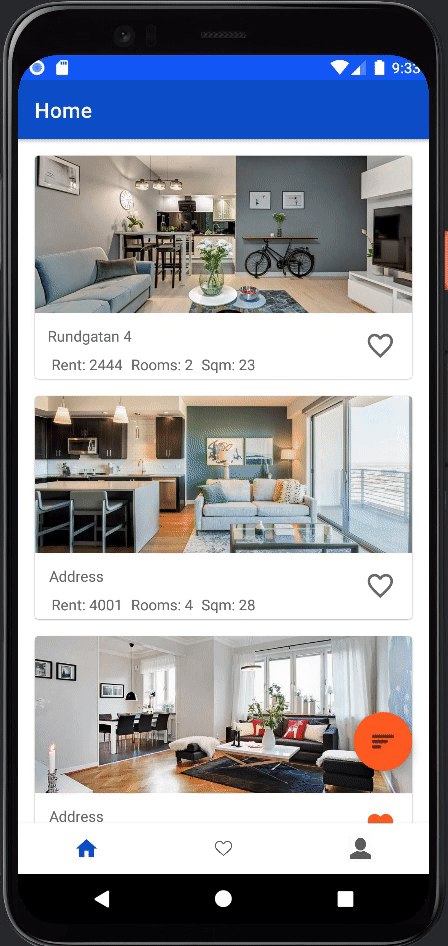
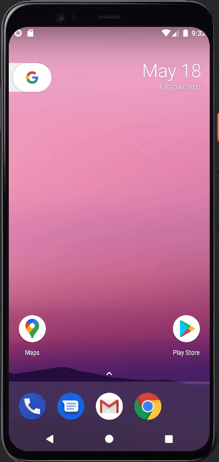

# DAT257 Team Abacus - ChangeIt
Welcome to Team Abacus's project - ChangeIt 



## Directory structure
```bash
.
├── App
│   ├── app
│   └── gradle
├── Images
├── Personal-Reflection
│   ├── Amanda-Styff
│   ├── Izabell-Arvidsson
│   ├── Kerstin-Wadman
│   ├── Lisa-Samuelsson
│   ├── Marcus-Randevik
│   ├── Moa-Berglund
│   └── Noa-Tholen
├── Project\ Scope
└── Protocol
```

## About
ChangeIt is an Android-app aimed at students living in SGS student accomodation that wants to change apartments with another student.

In the app, one student can find another student to switch apartments with, if they both live in a SGS student accommodation.
This could be useful if a student would like to try out another area of Gothenburg, or if they need more/less square meters. 

The platform gathers all exchange possibilities, and contact can then be made between the two or three parties/users. They can then apply on the SGS website as usual, as we don’t facilitate the exchange process itself. 

The purpose of the app is to make it easier for students looking for a switch in accomodation, and to make the process smoother by gathering all options in one place. 

Our stakeholder is a student named Lisa, who wanted to find a better solution for switching SGS apartments.

## Installation

> Important, if you don't have access to an Android Phone, please also install the [android emulator](https://developer.android.com/studio/run/emulator#install).

1. Download and install [Android Studio](https://developer.android.com/studio)


2. Clone the repo:

```shell
git clone https://github.com/MarcusRandevik/Team-Abacus.git
```

4. Using Android studio, open an existing project at the folder `<repo_location>/Team-Abascus/App`
   
6. Run the app using the green play button at the top of Android Studio

The app has primarily been developed and tested with devices using API 26 and higher, thus that is the recomended minimun API level. Though it should work on devices as old as API 21.

## Main Features
Below follows a brief description of the main features of the app.

### List of available apartments
Upon opening the app users will see a list of apartsments that have been submitted by other users. On this page, users can click on a specific apartment to see more details, such as more images and what the owner is looking to switch to. 


### Detailed apartment view
Once an owner have click on an apartment from the list view, thy're able to see more details about a specific apartment. A user may also see the contact details of the owner in order to be able to initiate an exchange of apartments and may also get a shareable link that, when clicked, will guide another user to this apartment.



### Profile
On the profile page, a user can see their own contact details as well as a profile picture. From this page, a user may also create an advertisement for their own apartment and when no longer needed, the ad can be deleted.



### Sharable links 
As mentioned before, a user can get a sharable link from the detailed view of an apartment. This can be sent to others so that they may easily navigate to a specific apartment.



## Architecture
See [Architecture document](App/architecture.md)

## Links
Scrum board: https://trello.com/b/HXAi7nDr/sgs

Team reflections: https://drive.google.com/drive/folders/1667BmL4INOtnAechYg0oBLwg9UqHS3yh?usp=sharing

KPI's: https://drive.google.com/drive/folders/10u9iXjdUpiXT_y2W-XOoDItGx4GC-FSt?usp=sharing


## Team members
[amandastyff](https://github.com/amandastyff) - Amanda Styff

[IzabellArvidsson](https://github.com/IzabellArvidsson) - Izabell Arvidsson

[kerwad](https://github.com/kerwad) - Kerstin Wadman

[lisaelsi](https://github.com/lisaelsi) - Lisa Samuelsson

[MarcusRandevik](https://github.com/MarcusRandevik) - Marcus Randevik

[moa114](https://github.com/moa114) - Moa Berglund

[noatholen](https://github.com/noatholen) - Noa Tholén
